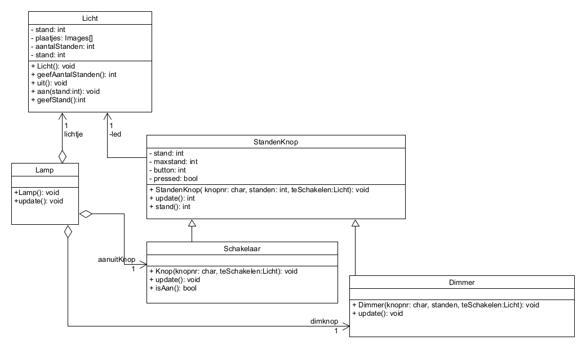
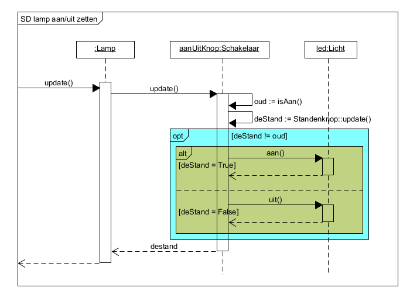

# Ontwerp rapport "Dimbare Lamp"

## 1. Inleiding

Dit is het ontwerp-rapport van het demo projectje "Dimbare Lamp". Dit is natuurlijk maar een klein simpel projectje, en dus is dit ontwerp ook klein en simpel. In serieuzere projecten zal een ontwerprapport ook uitgebreider zijn. Zaken die dan aan bod kunnen komen, maar hier nog ontbreken kunnen dan bijvoorbeeld zijn:

- beschrijvingen van gebruikersgroepen
- uitgebreidere eisen en randvoorwaarden, bv ook financiele randvoorwaarden of niet functionele systeemeisen
- architectuur overwegingen (komt aan bod in jaar 2)
- diepgaandere uitwerkingen van ontwerpkeuzes (ook jaar 2)

## 2. Functioneel ontwerp

### 2.1 Project beschtijving

Het probleem wat hier getackelt wordt is allerdaags. 's Avond als het donker wordt willen we een lamp in huis, maar omdat teveel licht als ongezellig wordt ervaren willen we de felheid van het licht van die lamp kunnen regelen.

Dit project heeft tot doel om een proof of concept te maken van zo'n dimbare lamp, om de haalbaarheid van dat concept aan te tonen. Hiervoor gebruken we de MicroBit, omdat dit veiliger te gebruiken is dan lampen die op 220 Volt werken, en bovendien is het goedkoop.

### 2.2 Use Cases

Analyse met bewoners heeft opgeleverd dat er 2 use-cases zijn: Een lamp aan of uit zetten, en een lamp dimmen.

---

**use case**:                  Lamp aan/uit zetten  
**Korte omschrijving**:        Zet de lamp aan of uit  
**Aannamen (precondities)**:   Er staat stroom op de lamp  
**Resultaat (postcondities)**: De lamp staat aan danwel uit, naar gelang de bewoner dat wenst.  
**Fout situaties**:            -  
**Systeem status na fout**:    -  
**Actoren**:                   Bewoner  
**Trigger**:                   De bewoner wenst licht, terwijlde lamp uit staat. Of de lamp staat aan, en de bewoner went geen extra licht.  
**Beschrijving (main flow)**  

- De bewoner drukt op knop A  
- Als het licht aan was, zal het licht uit gaan. Als het licht uit was, zal het licht aan gaan.  
- De bewoner kijkt of hij nu tevreden is met de hoeveelheid licht (1).  

**Alternatieve flow**          (1) Als de bewoner niet tevreden is met de ingestelde hoeveelheid licht, kan de lamp meer of minder gedimd worden. Zie usecase 'Dimstand aanpassen'

---

**use case**:                  Dimstand aanpassen  
**Korte omschrijving**:        Pas de felheid van de lamp aan  
**Aannamen (precondities)**:   Er staat stroom op de lamp  
**Resultaat (postcondities)**: De felheid van de lamp is ingesteld zoals de bewoner dat wenst.  
**Fout situaties**:            -  
**Systeem status na fout**:    -  
**Actoren**:                   Bewoner  
**Trigger**:                   De bewoner wenst dat de lamp feller of minder fel staat ingesteld.  
**Beschrijving (main flow)**:  

a. De bewoner drukt op knop B
a. Als het licht aan is:

   - Als het licht op zijn felst stond, zal het op zijn zwakst gaan branden.
   - Anders zal het licht iets feller gaan branden.
   - Er zijn 3 standen waartussen geswitcht wordt.

   Als het licht uit is zal gewisseld worden tussen dezelfde 3 standen, maar nu zal het licht ook kort aangaan in de nieuwe ingestelde stand.

a. De bewoner kijkt of hij nu tevreden is met de hoeveelheid licht, en herhaal de stappen vanaf stap a indien gewenst.  

**Alternatieve flow**:         Als de bewoner minder licht wil dan in de laagste stand van de dimmer, kan de lamp uit gezet worden. Zie use-case 'Lamp aan/uit zetten'.

---

Opgemerkt kan worden dat er is gekozen voor een functioneel ontwerp met twee knoppen. Één om de lamp aan en uit te zetten, en één om te kunnen dimmen. Hierdoor wordt het ook mogelijk om de dimstand aan te passen als de lamp uit staat.

### 2.3 klassen diagram (functioneel)

We kunnen dus op functioneel niveau vaststekken dat de lamp zal bestaan uit de lamp zelf, die we hier vanwege de naamsverwarring 'licht' zullen noemen, een schakelaar om het licht aan en uit te doen en een dimmer waarmee het licht in standen gezet kan worden (dus kan wisselen van stand).

## 3. Technisch ontwerp

Er is gebruik gemaakt van de MicroBit als platform voor de proof-of-concept. De microbit is geprogrammeerd in de Arduino IDE. Er is dus geen *main()*  functie maar een wel een bestand lamp-demo.ino net een *setup()* en een *loop()*. Alle klassen zijn geschreven in c++ en hebben een eihen header file en cpp file.

### 3.1 Klassen diagram (design)

#### De knoppen {-}

Meest in het oog springende verschil met het functionele klassen diagram is de toevoeging van de '*StandenKnop*' klasse. Aangezien zowel de *Schakelaar* als de *Dimmer* worden geimplementeerd met dezelfde knoppen van de Microbit, ligt het voor de hand hier dezelfde basiscode te gebruiken.

Een *StandenKnop* is gekoppeld aan een van de 2 knoppen (A of B) van de MicroBit. Verder heeft een *StandenKnop* een associatie met het *Licht* object wat hij bedient.

Een *StandenKnop* kan, zoals de naam doet vermoeden, in meer dan 2 standen staan. Voor de *Dimmer* zijn er netzoveel standen als dat er dimstanden zijn. Voor een normale Aan-Uit *Schakelaar* zijn er 2 standen.

Aangezien het indrukken van de knop geen hardware-event triggert, heeft een *StandenKnop* een *update()* functie om te kijken of er op de knop gedrukt is. Deze *update()* functie wordt vanuit de main loop van de applicatie aangeroepen.

#### Het Licht {-}

De *Licht* klasse heeft de standen 0, 1, 2, 3. De lamp is uit bij 0 en brand mazimaal bij 3.

De *Licht* klasse gebruikt het scherm van de MicroBit om de felheid van de lamp te simuleren. Er brand 1 LED bij gedimd licht en alle LED's branden in de meest felle stand.

#### De Lamp {-}

De *Lamp* klasse creeert de knoppen objecten en het Licht object, en koppelt de knoppen aan het Licht.

Verder bevat het de *Lamp.update()* functie die niets anders doet dan op zijn beurt de *update()* functie van de beide knoppen aan te roepen. *Lamp.update()* zelf, wordt aangeroepen vanuit de main loop van de Arduino (*.ino) file. **Omdat die laatste geen klasse bevat, enkel losse functies,  zie je die niet in het klassen diaagram.**

### 3.2 Sequentie diagrammen

Het sequentie diagram van de use-case 'Lamp aan/uit zetten'.

Je kunt je afvragen waar de interactie met de actor is. Deze is hier niet te zien omdat de actor interacteert met de
*Button* klasse van Microbit, en bij het modelleren werk je enkel je **eigen** geschreven objecten uit, en niet (of veel minder) die van de packages die je gebruikt.  
Dus de interactie met de actor is er wel, maar zit 'verstopt' in de *update()* functie van de *Schakelaar*. Deze functie gebruikt de Button klasse.

En een sequentie bij de tweede use-case.

Let bij deze sequentie vooral even op het volgende: zowel de Lamp heeft een stand als de Dimmer heeft een stand.
De lamp heeft standen 0 t/ 3, waarbij 0 uit is. De Dimmer heeft standen 0 t/m 2, waarbij 0 de stand LAAG is.  

Lamp stand 1 komt dus overeen met Dimmer stand 0!!